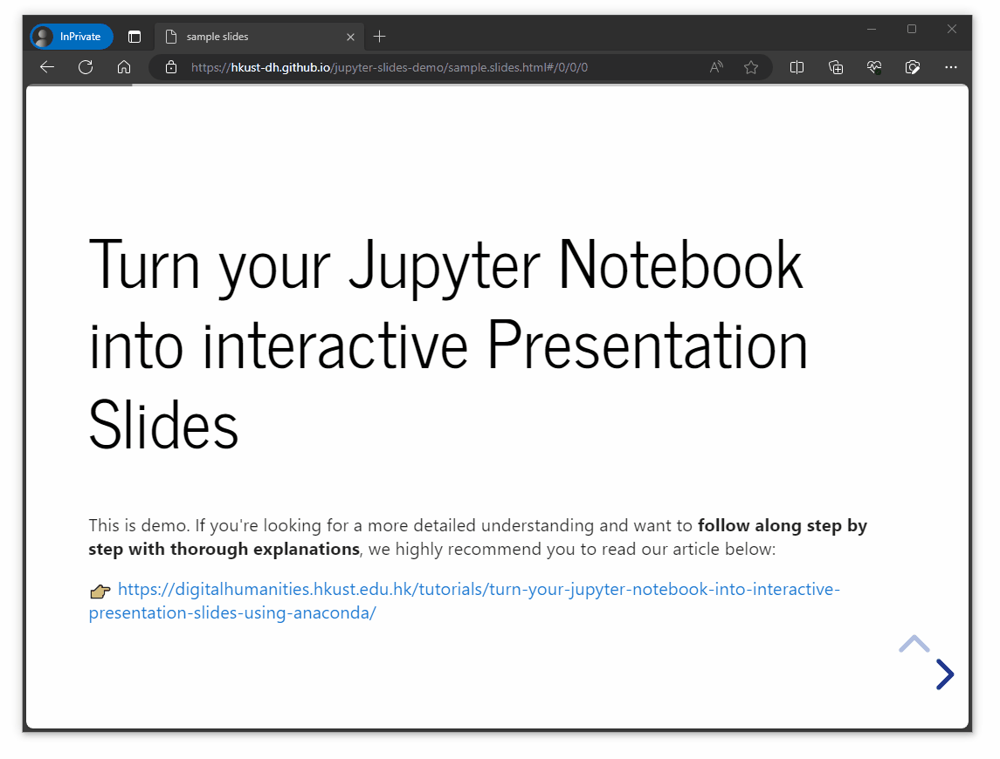

# Turn Your Jupyter Notebook Into Interactive Presentation Slides Using Anaconda

👉 **Data file**: [sample.ipynb](https://github.com/hkust-dh/jupyter-slides-demo/blob/main/sample.ipynb)

The file above serves as a sample file to help you grasp the speed and simplicity of converting a Jupyter Notebook (.ipynb file) to a HTML file.

If you are interested in learning the step-by-step process of how to do so, please refers to our article below for detailed instructions and explanations:

-   https://digitalhumanities.hkust.edu.hk/tutorials/turn-your-jupyter-notebook-into-interactive-presentation-slides-using-anaconda/

---

# How to host your website on GitHub Pages

👉 **demo URL**: https://hkust-dh.github.io/jupyter-slides-demo/sample.slides.html

This website above serves as a demo to showcase the capabilities of hosting HTML files in Github Pages. If you are interested in learning the step-by-step process of how to do so, please refers to our article below for detailed instructions and explanations:

-   https://digitalhumanities.hkust.edu.hk/tutorials/how-to-host-your-website-on-github-page/

